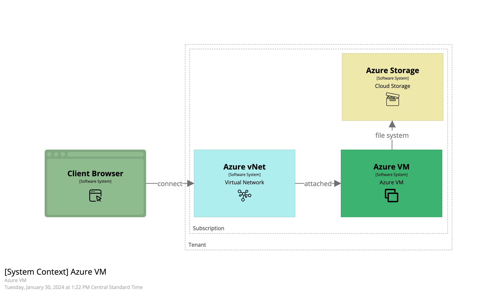
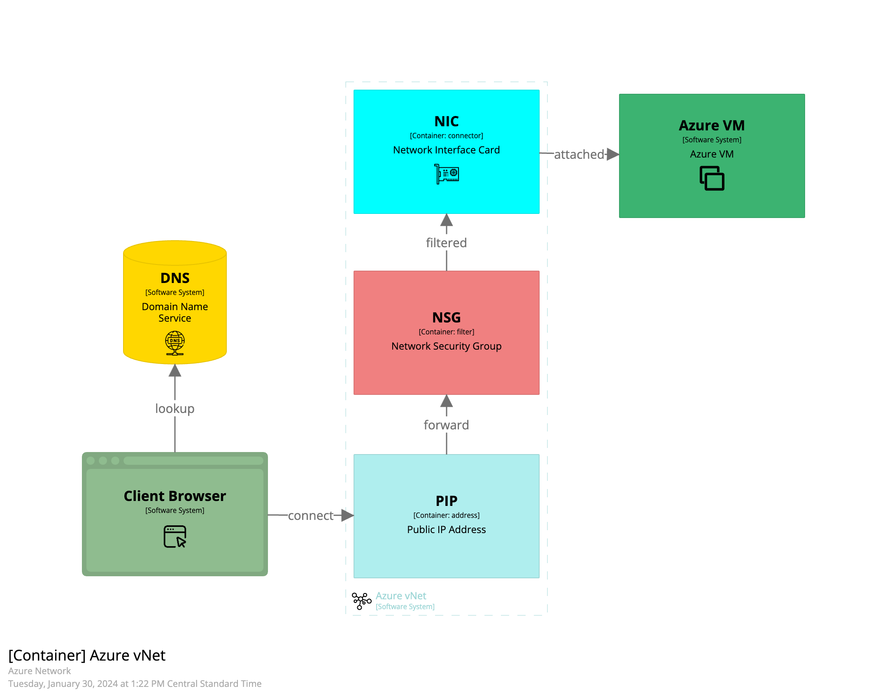
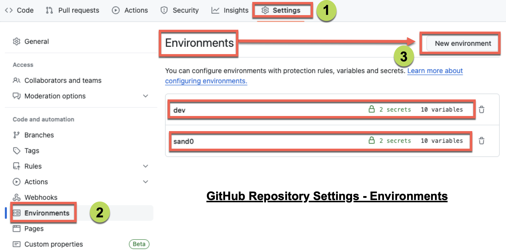

# Terraform: Azure VM Deploy

This repository uses GitHub environment variables and secrets to deploy Virtual Machines (VMs) to Azure using GitHub Actions for Terraform automation.

Note this README is expanded in the README folder:

- [README/docs/01_overview.md](README/docs/01_overview.md)



## Table of Contents

- [Description](#description)
- [Installation](#installation)
- [Usage](#usage)

## Description

This project (AzureVmDeploy) uses Terraform to plan, deploy, and destory a Linux VM. This is setup to be run as a manual GitHub Actions Workflow.

Manually initiate the GitHub Action Workflow in the order below to build the VM.

- an Azure storage account to store the Terraform state file
- a virtual network for hosting
- a linux VM with a public IP address



## Installation

To utilize this AzureVmDeploy project:

1. Setup your Repository on github with required variables and secrets.

The GitHub Actions (GHA) workflow included with this repository will work with public and paid private repositories which support Environments. 

Note: An alternate GHA workflow can be used to work with Global variables and secrets (i.e. free + private repositories do not support Environments).

Setup and new "Environment" to deploy your new Virtual Machine (VM) to.



    Variables:
    - ARM_TENANT_ID
    - ARM_SUBSCRIPTION_ID

    - ARM_CLIENT_ID
    - TFSTATE_SUFFIX - ensure the TF state storage account name is unique
    - INFRA_NAME - group/project name for Azure resources
    - LOCATION - an Azure region name
    - CIDR_BLOCK - 10.x.0.0./20 - pick an X in range 0 to 255
    - VM_NAME - name of VM host
    - VM-SIZE - an Azure VM size name
    - SSH_SRC1 - IP address to permit for SSH login

    Secrets:
    - ARM_CLIENT_SECRET - password for Terraform service account
    - ARM_TFSTATE_KEY - added after Terraform (TF) State storage is created

    Notes:

    1. The ARM_TFSTORE_ACCESSKEY is used to access the TF State storage file. The TF State provides critical perisistence data to the Terraform deployment.
    1. ARM_TFSTORE_ACCESSKEY is added to the GitHub "secrets" on AFTER the TFState storage account is deployed.
The single provided workflow uses ENV_NAME to switch between environments. This allows you to use a free and private repo (which does not support Environments).
    1. Create a repository from this repository template [https://github.com/sheeriot/DevHostAzure](https://github.com/sheeriot/DevHostAzure)

## Usage

1. Will need an Azure AD Service Principal. In this example, scoped to a subscription

```bash
az ad sp create-for-rbac --name "svc-terraform-myproj" --role contributor --scopes /subscriptions/12345678-1234-1234-1234-123456789012
```

1. First run the TFState Apply component. You can test with Plan. After TF State is deployed, validate it in the Azure portal. Go to the new Azure Storage Account and get an Access Key to provide as secret ARM_ACCESS_KEY in GitHub.

1. Next deploy the Network component. The terraform state for the Network component will be saved in the Terraform State account. Go look at it. Validate.

1. Setup the Terraform for the new Virtual Machine (VM).

   - add your own source IP address (for SSH access) and SSH Public Key
     - edit the `azure/devhost/terraform.vars` as needed
     - an SSH (TLS) Key-Pair is also created as a terraform resource and stored with terraform state
         - the public key has been provided to the new linux host as an `authorized_key`
         - the private key can be used as an `IdentityFile`
   - modify the terraform as you see fit including the file `scripts/cloud-init.tfpl` to customize your linux host on first boot

1. Update the env.sh file header variables to name your Network and Compute.

- `INFRA_NAME`
- `COMPUTE_NAME`

1. Deploy your VM

1. SSH to your VM using your defined IP address (source) and Public Key (added).
