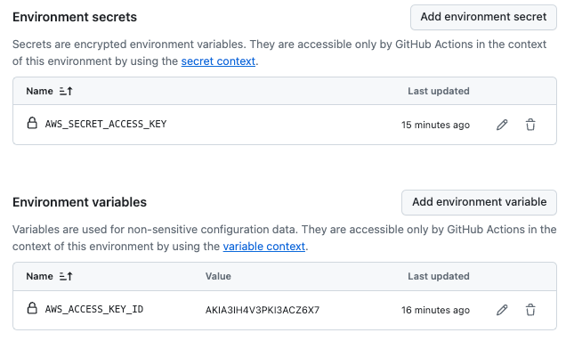

# AWS VM Deploy DocSet

## AWS Prep

To deploy to AWS using Automation, some prep work is require setup a Service Account in IAM (Identity and Access Management) on AWS.

GitHub Actions drive Terraform Deployments.

[Login at AWS Console](https://aws.amazon.com/console/)

### Create the Terraform Service Account on AWS

Using the AWS (Web) Console, as needed, create a new IAM user to be used as the Service account for Terraform actions.

To create a Terraform service account on AWS, you can follow the steps outlined in this [Medium article](https://gmusumeci.medium.com/how-to-create-an-iam-account-and-configure-terraform-to-use-aws-static-credentials-a8ea4dd4fdfc).

The screenshot below shows the IAM User and the Access Key created for the Terraform access from Github. Scoping of permissions for that user is beyond the scope of this article. Scoping permissions is a critical part of system security.

Screen Shot

This command will output an application ID and password to use for this service account. Document the details in your password safe and add them to the GitHub enviornment, as needed.

- AWS_ACCESS_KEY_ID - a GitHub environment variable
- AWS_SECRET_ACCESS_KEY - a GitHub environment secret

### AWS IAM Policies

Setup needed policies on user as need.
