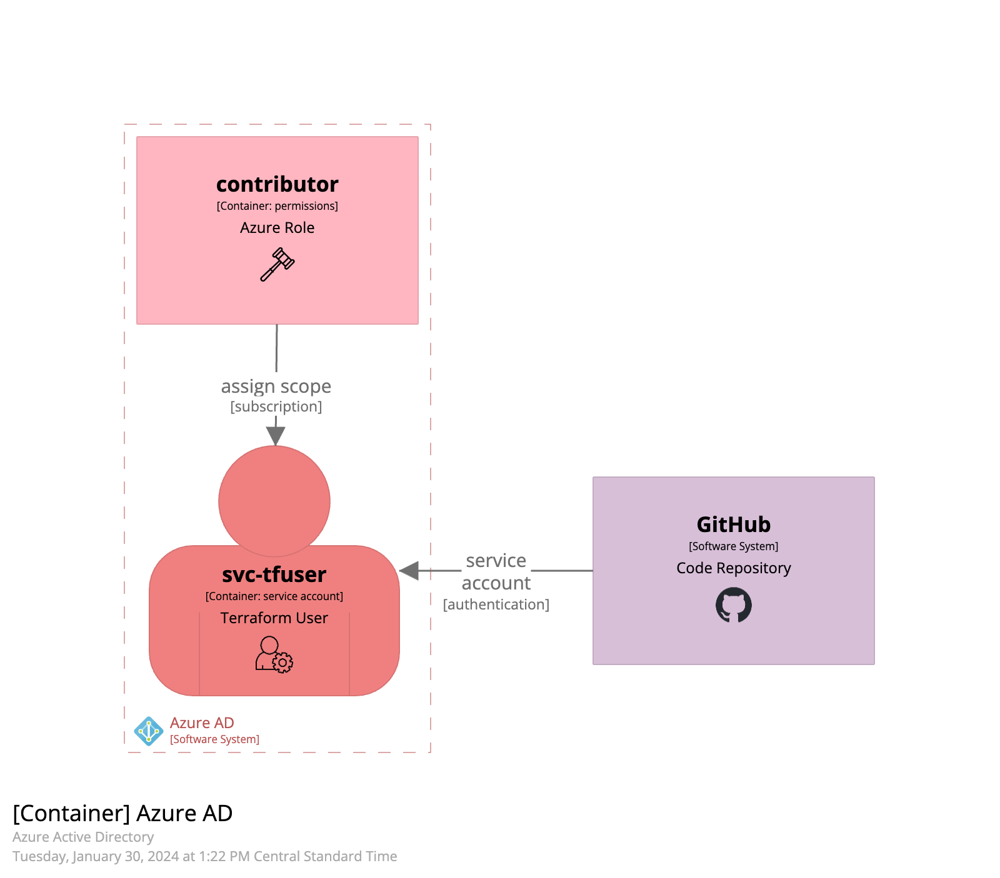

# Azure VM Deploy DocSet

## Azure Prep

To deploy to Azure using Automation, some prep work is require setup a Service Account in Active Directory.

GitHub Actions drive Terraform through Azure Resource Manager.

![GitHub Actions drive Terraform Automation through Azure Resource Manager]

### Create the Terraform Service Account on Azure

Using the Azure CLI, as needed, create a new Azure Active Directory - Service Principal. In this example, scoped to a subscription

The Azure CLI example below creates a new Service Account (aka AD SP) and assigns the contributor role on the targetted subsciption (scope).

```bash
az ad sp create-for-rbac --name "svc-terraform-myproj" --role contributor --scopes /subscriptions/12345678-1234-1234-1234-123456789012
```

This command will output an application ID and password to use for this service account. Document the details in your password safe and add them to the GitHub enviornment.

- ARM_CLIENT_ID - a GitHub environment variable
- ARM_CLIENT_SECRET - a GitHub environment secret

### Azure AD Assigned Role

This diagram shows the Role of "contributor" assigned to a user "svc-tfuser" and scoped to a subscription.


