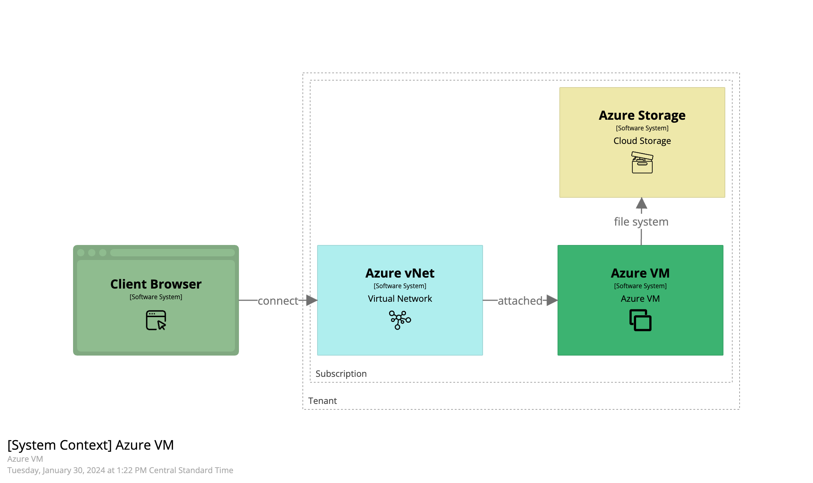
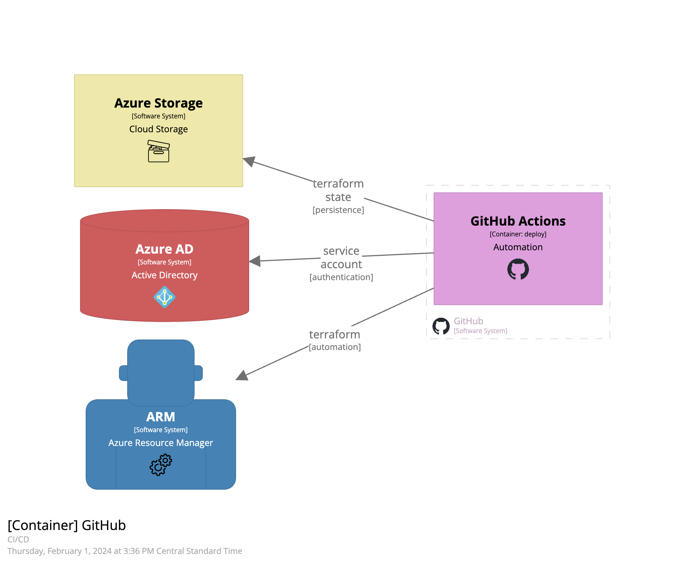
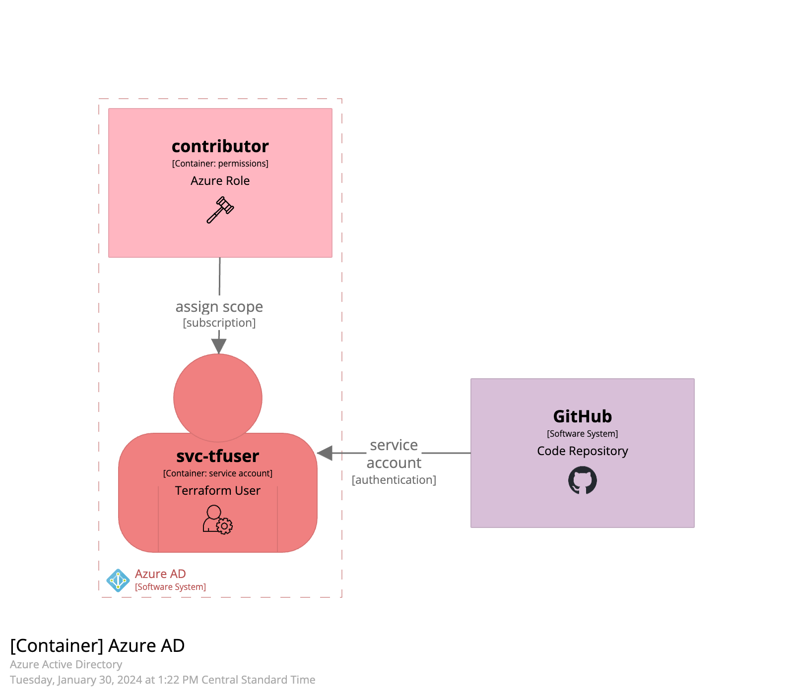

# Azure VM Deploy DocSet

## Overview

This project (AzureVmDeploy) uses Terraform to plan, deploy, and destory a Linux VM. This is setup to be run as a manual GitHub Actions Workflow.

Manually initiate the GitHub Action Workflow in the order below to build the VM.

1. an Azure storage account to store the Terraform state file
1. a virtual network for hosting
1. a linux VM with a public IP address

### Azure Prep

Create a Service Account to run Terraform via GitHub Actions.

* [02_azureprep.md](02_azureprep.md)

### GitHub Prep

Numerous variables and a couple of secrets need to be setup in the GitHub environment (settings).

More Info: [03_githubprep](03_githubprep)

### Create TF State Storage

Deploy Terraform (TF) State Storage Account using the GitHub Action workflow.

* one secret: ARM_CLIENT_SECRET
* several variables: tenant, subsciption, location, etc.

### Create Virtual Network

Run the workflow to Apply the Network. Use a unique CIDR block for each environment to aid administration.

### Create Virtual Machine

Run the GitHub Actions Worfklow to create the new VM. Variables can be used to set VM Name, Size, and the source IP address for SSH connection from the administrator.

The VM uses a Public IP (PIP), a Network Security Group (NSG), and a Network Interface Card (NIC) to route, filter, and connect internet to the VM.

### Connect to the VM

Using the powers of SSH Keys, connect to the VM!
