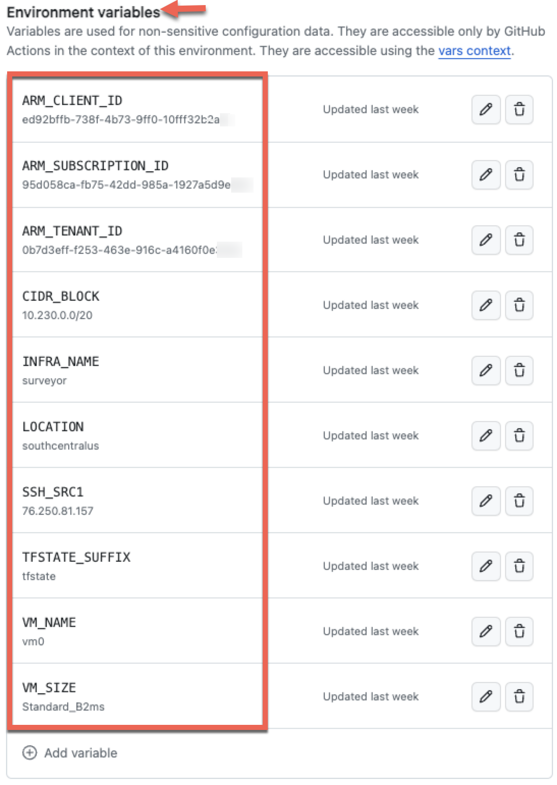

# Azure VM Deploy - DocSet

## GitHub Prep

### On GitHub Environments

Public GitHub repos and paid-for private repos can use Environments.

Free and private repo do not support Environments, but you need the workflow to accept the ENV_NAME as a Variable name, as it cannot be inherited from the environment.

This repo was built to work with Global environment only:

* [https://github.com/sheeriot/DevHostAzure](https://github.com/sheeriot/DevHostAzure)

### Setup each GitHub Enviornment

Access the repository Settings page to setup each environment variable and secret.

### Variables and Secrets

The following variables are needed to complete the workflow tasks (tfstate, network, vm).

| Variables          | Description             |
|--------------------|-------------------------|
| ARM_TENANT_ID      |                         |
| ARM_SUBSCRIPTION_ID|                         |
| ARM_CLIENT_ID      |                         |
| INFRA_NAME         | group/project name      |
| LOCATION           | Azure region name       |
| CIDR_BLOCK         | 10.x.0.0./20 - pick x   |
| VM_NAME            | name of VM host         |
| VM-SIZE            | Azure VM size name      |
| SSH_SRC1           | IP address got SSH      |

The following secrets are needed to complete the workflow tasks.

| Secret            | Description                                         |
|-------------------|-----------------------------------------------------|
| ARM_CLIENT_SECRET | password for Terraform service account              |
| ARM_TFSTATE_KEY   | added after Terraform (TF) State storage is created |

After the TF State account is created, retrieve a Key and add it as the secret: ARM_TFSTATE_KEY.

### Example of Environment Variables

The screenshot below shows the _variables_ setup for an environment in GitHub Settings.

