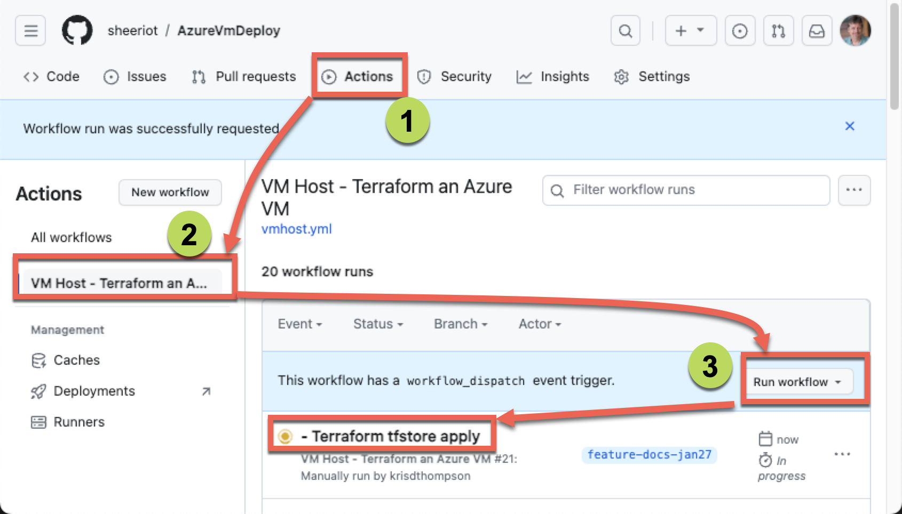
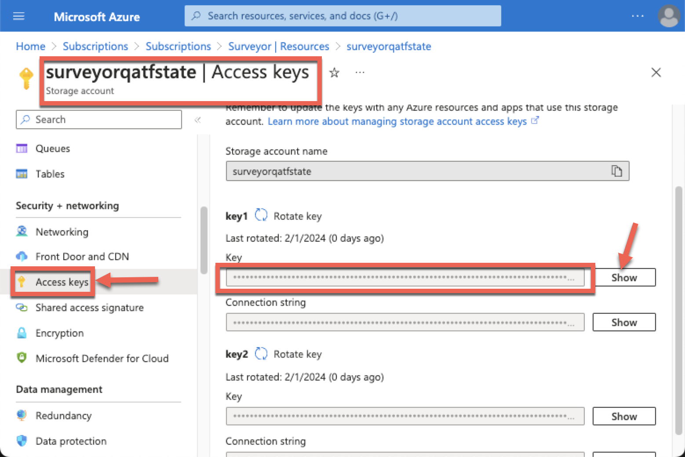

# Azure VM Deploy - DocSet

## Terraform State Storage Account

The Terraform technology uses a Terraform (TF) State file to provide persistence between runs.

Each "Component" of Terraform (i.e. network, vm) will produce a Terraform State (aka tfstate) file.

### Execute GitHub Action Workflow: TFState Storage

Use GitHub Actions to start a workflow to create the Terraform State storage account (TFStore).

### Start the Worflow

### Get the Key

Once the TFStore is created, go get the ARM_TFSTATE_KEY to add to the GitHub environment settings.

Add this to the GitHub environment as the secre: ARM_TFSTATE_KEY
