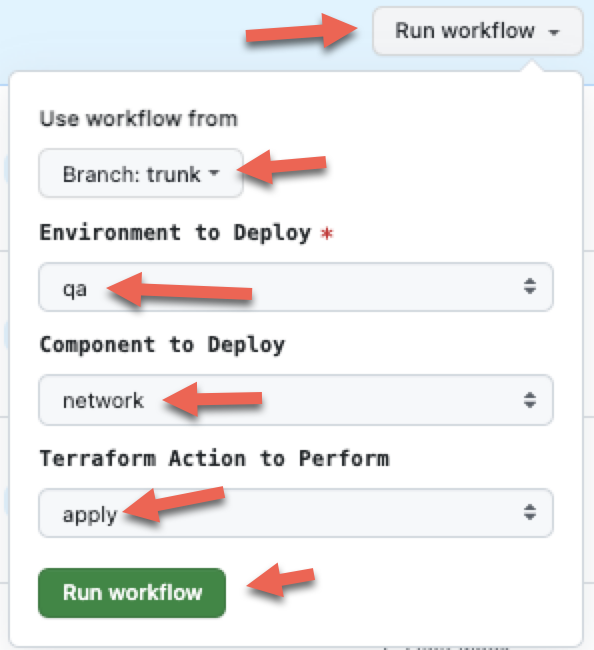

# Azure VM Deploy - DocSet

## Azure Network Create

Now that the TFStore storage account has been created and the ARM_TFSTATE_ACCESSKEY has been added to the GitHub Environment Secret, you can now deploy the Azure Virtual Network (vNet).

The Azure vNet is created with subnets for hosting the VM and other services.

